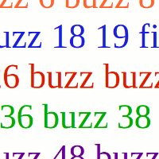

## fizzbuzz :fireworks:
Use TDD to write a function that will take a number as an argument and returns 'fizz' if the number is divisible by 3, 'buzz' if the number is divisible by 5 and 'fizzbuzz' if the number is divisible by both 3 and 5. If the number is neither divisible by 3 or 5, then return the number.

```js
function fizzbuzz (number) {
  // your code here
}
console.log(fizzbuzz(3)) // 'fizz'
console.log(fizzbuzz(5)) // 'buzz'
console.log(fizzbuzz(15)) // 'fizzbuzz'
console.log(fizzbuzz(7)) // 7
```
### Bonus
Create an interactive HTML page using DOM, expected outcome; user enters a number into the input box a function runs when you press submit that pins to the DOM whether your triggerd fizz, buzz, fizzbuzz, or error. Then you can enter a new number and try again.

----

### Quick Links -->
- [Initial Setup](#initial-setup)
- [Return a number when the number is not divisible by 3 or 5](#return-a-number-when-the-number-is-not-divisible-by-3-or-5)
- [Return 'fizz' when number is divisible by 3 and not divisible by 5](#return-fizz-when-number-is-divisible-by-3-and-not-divisible-by-5)
- [Return 'buzz' when number is divisible by 5 and not divisible by 3](#return-buzz-when-number-is-divisible-by-5-and-not-divisible-by-3)
- [Return 'fizzbuzz' when number is divisible by both 5 AND 3](#return-fizzbuzz-when-number-is-divisible-by-both-5-and-3)
- [Conclusion](#conclusion)
- [Bonus](#bonus)

----

## Initial Setup
Let's set up our file structure and use npm to setup our project to use jest

Using the terminal:

**1. Create a new folder called fizzbuzz and change directory into it**
```
mkdir fizzbuzz && cd fizzbuzz
```
**2. Add a file called fizzbuzz.js**
```
touch fizzbuzz.js
```
**3. Create a tests folder and change directory into tests**
```
mkdir tests && cd tests
```
**4. Inside tests folder, create a file called fizzbuzz.test.js**
```
touch fizzbuzz.test.js
```
**5. change into fizzbuzz directory**
```
cd ..
```
**6. Create package.json using npm (skip through questions by pressing enter)**
```
npm init
```
**7. Install jest using npm, and save as a development dependency**
```
npm install -D jest
```
**8. In our package.json, under scripts add "tape ./test/*.test.js | tap-spec" like the following:**
```javascript
"scripts": {
  "test": "jest"
},
```

Now when we run the command 'npm run test' in our terminal, npm will run our test script using jest. We let tape know where our test scripts are by specifying a path './tests/*.test.js', so any files that end with .test.js inside our tests folder will be run by jest.

**9. Type the following code to fizzbuzz.js**
```javascript
function fizzbuzz(number) {
}
module.exports = fizzbuzz;
```
Here we define a function called fizzbuzz which accepts one argument which will be assigned to a variable called number. 
We then assign this function to module.exports so we are able to use our fizzbuzz function in another file in our code.

For more info about module.exports [See here](https://www.sitepoint.com/understanding-module-exports-exports-node-js/)

----

## Return a number when the number is not divisible by 3 or 5 
Let's write some tests to check if our function returns the number when the number is not divisible by 3 or 5.

**1. Let's write a test unit. Type the following into fizzbuzz.test.js:**
```javascript
describe('fizzbuzz', () => {
  it('should have 2 when two passed', () => {
    expect(fizzbuzz.fizzbuzz(2)).toBe(2);
  });
})
```
**2. Inside fizzbuzz.js, write the minimum amount of code so that the test passes as follows:**
```javascript
function fizzbuzz(number) {
  if (number === 2) return 2
}
module.exports = fizzbuzz;
```
**4. run 'npm run test'**
```javascript
npm run test
```
The tests should now pass.

**5. Let's add a few more tests, in fizzbuzz.test.js:**
Instead of writing the tests separately like this:

```javascript
describe('fizzbuzz', () => {
  it('should have 2 when two passed', () => {
    expect(fizzbuzz.fizzbuzz(2)).toBe(2);
  });
});
describe('fizzbuzz', () => {
  it('should have "fizz" when three passed', () => {
    expect(fizzbuzz.fizzbuzz(3)).toBe('fizz');
  });
});
```
We can group similar tests together like this: 
```javascript 
describe('fizzbuzz', () => {
  it('should have 2 when two passed', () => {
    expect(fizzbuzz.fizzbuzz(2)).toBe(2);
  });
  it('should have "fizz" when three passed', () => {
    expect(fizzbuzz.fizzbuzz(3)).toBe('fizz');
  });
})
```
**6. Let's make these tests pass, in fizzbuzz.js type the following code:**
```javascript
function fizzbuzz(number) {
  if (number === 3) return 'fizz';
  else if (number === 2) return 2;
}
module.exports = fizzbuzz;
```
**7. The if statements are not really ideal, especially if we need our function to cover a larger range of numbers (e.g between 1 and 10,000). Wouldn't it better to refactor our code so it takes into account any number that isn't divisible by 3 or 5?**

The remainder operator returns the remainder left over when one operand is divided by a second operand. [See here for more info](https://developer.mozilla.org/en-US/docs/Web/JavaScript/Reference/Operators/Arithmetic_Operators)

We can use the remainder operator to check if a number is divisible by another number.

Examples:
```javascript
10 % 2    // 0
11 % 2    // 1
```
If the remainder is zero then we know that the second operand is a divisor of the first operand. e.g 10 % 2 equals zero, which means 10 is divided by 2 with no remainder left over. We can also check if the second operand is not a divisor of the first operand e.g 11 % 2 equals 1, which is not equal to zero.

We can use this in our code to check if a number is not divisible by 3 AND is not divisible by 5. In fizzbuzz.js, refactor as follows:
```javascript
function fizzbuzz(number) {
  if (number % 3 !== 0 && number % 5 !== 0) {
    return number
  }
}
module.exports = fizzbuzz;
```
**8. npm run test**
```javascript
npm run test
```
We should see the tests passing.

----

## Return 'fizz' when number is divisible by 3 and not divisible by 5
Let's write some tests to check if our function returns 'fizz' when number is divisible by 3 and NOT divisible by 5.

**1. Let's define a new test and then add group all our tests as follows:**
```javascript
describe('fizzbuzz', () => {
  it('should have "fizz" when three passed', () => {
    expect(fizzbuzz.fizzbuzz(3)).toBe('fizz');
  });
  it('should have "fizz" when six passed', () => {
    expect(fizzbuzz.fizzbuzz(6)).toBe('fizz');
  });
});
```
**2. Now write some code to make the tests pass. Inside fizzbuzz.js, type the following:**

```javascript
function fizzbuzz(number) {
  if (number % 3 !== 0 && number % 5 !== 0) {
    return number
  } else if (number % 3 === 0 && number % 5 !== 0) {
    return 'fizz'
  }
}
module.exports = fizzbuzz;
```
**3. Now run the tests using:**
```javascript
npm run test
```
  Yes! It worked :)

----

## Return 'buzz' when number is divisible by 5 and not divisible by 3

**1. Let's define a new test and then group all our tests as follows:**
```javascript
describe('fizzbuzz', () => {
  it('should have "buzz" when five passed', () => {
    expect(fizzbuzz.fizzbuzz(5)).toBe('buzz');
  });
});
```
**2. Now write some code to make the tests pass. Inside fizzbuzz.js, type the following:**
```javascript
function fizzbuzz(number) {
  if (number % 3 !== 0 && number % 5 !== 0) {
    return number
  } else if (number % 3 === 0 && number % 5 !== 0) {
    return 'fizz'
  } else if (number % 5 === 0 && number % 3 !== 0) {
    return 'buzz'
  }
}
module.exports = fizzbuzz;
```
**3. Now run the tests using:**
```javascript
npm run test
```
Great! It works :)

----

## Return 'fizzbuzz' when number is divisible by both 5 AND 3
Let's write some tests to check if our function returns 'fizzbuzz' when number is divisible by both 5 AND 3.

**1. Let's define a new test and then group all our tests as follows:**
```javascript
describe('fizzbuzz', () => {
  it('should have "fizzbuzz" when multiple of three and five passed', () => {
    expect(fizzbuzz.fizzbuzz(30)).toBe('fizzbuzz');
  });
});
```
**2. Inside fizzbuzz.js, type the following:**
```javascript
function fizzbuzz(number) {
  if (number % 3 !== 0 && number % 5 !== 0) {
    return number
  } else if (number % 3 === 0 && number % 5 !== 0) {
    return 'fizz'
  } else if (number % 5 === 0 && number % 3 !== 0) {
    return 'buzz'
  } else {
    return 'fizzbuzz'
  }
}
module.exports = fizzbuzz;
```
**3. Run the tests:**
```javascript
npm run test
```
Excellent! Well done, you have just succesfully written the fizzbuzz function using Test-Driven Development!

----

## Conclusion
One of the greatest benefits of writing tests is that we can refactor our code and then run our tests again to make sure everything is working as we intended. If we didn't write any tests it would be very difficult to know if we broke something in the code when changes are made.

Let's demonstrate this by refactoring our code slightly and running the tests again.

**1. Re-write main .js code.**
Let's re-write our fizzbuzz function, but this time make the first if statement check if number is divisible by both 3 and 5 and return 'fizzbuzz' if true. We will also change the two else if statements as the first if statement checks for both conditions (divisible by both 3 and 5), so we only need to check if the number is either divisible by 3 (for fizz) or divisible by 5 (for buzz). Finally, we will include an else statement to return the number if none of the other conditions are met.
```javascript
function fizzbuzz(number) {
  if (number % 3 === 0 && number % 5 === 0) {
    return 'fizzbuzz'
  } else if (number % 3 === 0) {
    return 'fizz'
  } else if (number % 5 === 0) {
    return 'buzz'
  } else {
    return number
  }
}
module.exports = fizzbuzz;
```
**2. Refractor even further!**
```js
const fizzbuzz = function fizzbuzz(number) {
  if (number % 3 === 0 && number % 5 === 0) return 'fizzbuzz';
  else if (number % 3 === 0) return 'fizz';
  else if (number % 5 === 0) return 'buzz';
  return number;
};
```
**3. Run the tests, using npm run test.**
```javascript
npm run test
```
Awesome, our code still works as intended :)

----
